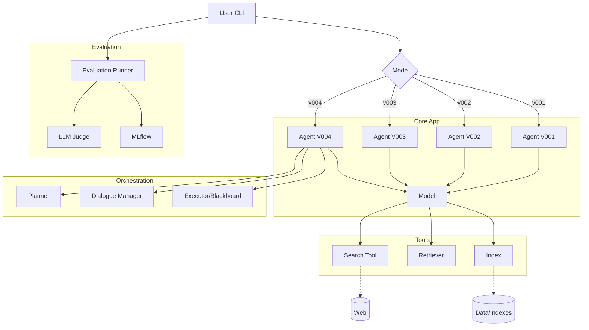
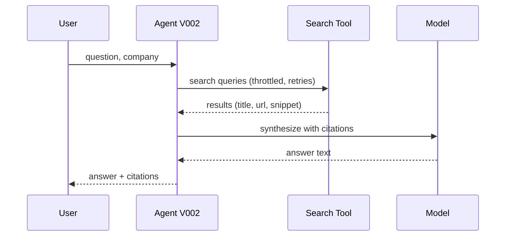
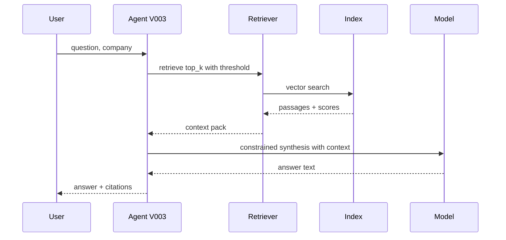
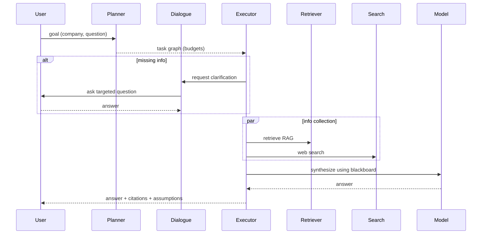

# Architecture

This document describes the repository structure and component interactions for V001–V004.

## Repository Structure

```
app/
  cli.py                 # CLI entrypoint for run/eval/ingest/deep
  agents/                # Agent implementations per version
  config/                # Layered YAML configs: defaults + version + profiles
  prompts/               # Versioned agent/planner/judge prompts
  tools/                 # Search, retriever, ingestion utilities
  orchestration/         # Planner, dialogue, executor, blackboard (V004)
  retrieval/             # Backends, chunking, embeddings, manifests (V003)
  evaluation/            # Datasets, judges, metrics, runner, reporting
  logging/               # Logging setup for structured logs

data/
  sources/               # Raw docs per company (local only)
  indexes/               # Vector indexes by company/version (gitignored)

artifacts/
  runs/                  # Run outputs (answers, contexts, judgments)
```

## High-Level Component Diagram



## Version-Specific Flows

### V002: Search Deep Research


### V003: Retrieval-Augmented Generation (RAG)


### V004: Deep Planning + Clarification


## Data Schemas (abridged)

- Evidence (blackboard):
```json
{
  "evidence_id": "uuid",
  "type": "rag|web|user",
  "text": "...",
  "source_uri": "doc://... | https://...",
  "score": 0.82,
  "timestamp": "ISO-8601",
  "provenance": {"company": "Acme", "chunk_id": "12"}
}
```

- Plan (V004):
```json
{
  "plan": [
    {"id": "step-1", "type": "retrieve_rag", "inputs": {"query": "..."}},
    {"id": "step-2", "type": "search_web", "when": "if recall low"},
    {"id": "step-3", "type": "ask_user", "when": "if ambiguity blocks synthesis"},
    {"id": "step-4", "type": "synthesize"}
  ],
  "budgets": {"max_steps": 20, "max_questions": 3}
}
```

- Retrieval Passage (V003):
```json
{
  "text": "...",
  "source_uri": "doc://kb/acme/overview.md",
  "chunk_id": "1",
  "score": 0.85,
  "metadata": {"company": "acme"}
}
```

## Notes
- Prompts are versioned and referenced by agents; planner prompt outputs structured JSON.
- Config layering: defaults -> version -> profile -> CLI overrides.
- Index manifests capture embedding/chunk settings for reproducibility.
